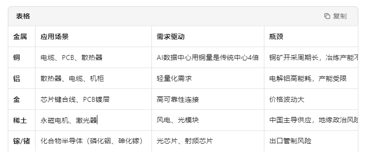

## 上游：基础设施与硬件层（"卖铲人"） 
    1. 算    力 （核心）： 英伟达gpu/博通tpu/华为昇腾
    2. 存储芯片 （数据仓库） ：三星、SK海力士、美光、西部数据/闪迪
                瓶颈---> HBM产能严重不足
    3. 半导体制造设备与材料（产业链基石）
       光刻机（asml） +  刻蚀机（台积电、三星） +  先进封装设备（CoWoS）
    4. 光通信/CPO（数据传输高速公路）  
       瓶颈： a. CPO技术不成熟：成本高、不可插拔、维护风险大，商业化至少需3-5年  
              b. 光纤短缺：Meta与康宁60亿美元合作锁定光纤供应，成为新瓶颈
    5. 高速互联（机柜内连接）  
          瓶颈：铜缆产能：GB300服务器推动铜缆需求暴增，罗森伯格发泡机产能稀缺   
    6. 散热/液冷（温控系统）
        液冷渗透率：2025年仅约20%，标准不统一
        漏液风险：对数据中心可靠性要求极高
        成本：液冷系统CAPEX比风冷高30-50%
    7. 电力/能源（算力的血液）  
    8. 有色金属/原材料（产业链上游）
       作用：提供芯片、电缆、散热器等所需的金属材料

              ↓  
## 中游：平台与系统集成层（"修路者"）  
              ↓  
## 下游：应用与商业变现层（"淘金者"）